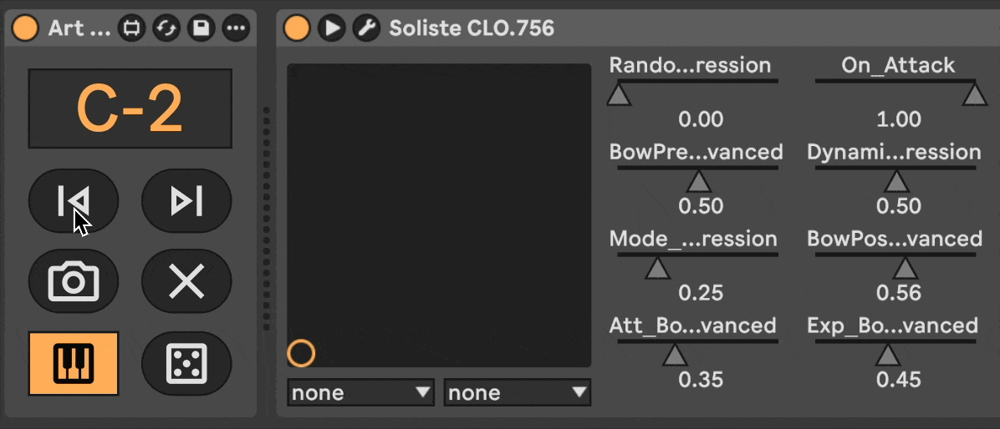

# Art-Keysnap [WIP]

> Articulation keyswitch snapshot, a [Max for Live](https://www.ableton.com/en/live/max-for-live/) device that captures VST instrument parameter snapshots and recalls them via MIDI keyswitches



## Usage

_coming soon_

## Alternatives?

- [Presets](https://killihu.vstskins.com/presets/) device by killihu
- Variations device in [Performance Pack](https://www.ableton.com/en/packs/performance-pack/) by Iftah

## Development

### Prerequisites

- configure [maxdiff](https://github.com/Ableton/maxdevtools/tree/main/maxdiff)

### Diff

```bash
git --no-pager diff "./Art Keysnap.amxd"
```

### Frozen testing

Save device in gitignored `./frozen/` folder, it will read the articulations.tsv file from folder above automatically.
